# Estudo do Conatiner 
## Sumário abaixo:
**É apresentado todo conteúdo que será apresentado desenvolvido**
>Você verá como instalar o [**Virtual Box**](https://virtualbox.org/) para criar VM(virtual machine)
>
>Como criar uma VM(virtual machine) do [**Ubuntu Server**](https://ubuntu.com/download/server) utilizando o software Virtual Box passo a passo
>
>Como criar um container dentro do sistema operaciopnal Ubuntu Server e gerenciar utilizando o sistema  [**Docker**](https://www.docker.com/) 

# Sumário:
## Conteúdo 
+ Instalação do Virtual Box
    - No [**Windows**](http://www.codeblocks.org/downloads/binaries/#imagesoswindows48pnglogo-microsoft-windows)
    - No [**Linux**](http://www.codeblocks.org/downloads/binaries/#imagesoswindows48pnglogo-microsoft-windows)
    - No [**Mac**](http://www.codeblocks.org/downloads/binaries/#imagesoswindows48pnglogo-microsoft-windows)
+ Baixando a ISO(International Organization for Standardization) no Ubuntu Server 22.04
   - No [**Windows**](https://ubuntu.com/download/server)
   - No [**Linux**](https://ubuntu.com/download/server)
   - No [**Mac**](https://ubuntu.com/download/server)
+ Instalando  Virtual Box 
+ Instalando Ubuntu Server 
+ Configurador Ubuntu Server
    + Ferramentas 
        + Vim
        + net-tools
    + Cockpit
    + Docker 
    + Docker-compose
        + Mysql
        + Adminer
        + Wordpress
---

# Instalação do Virtual Box 
1. Abra o navegador e acesse o site oficial do VirtualBox em https://www.virtualbox.org/.

2. Clique no botão "Downloads" no menu principal.
3. Na seção "VirtualBox 6.1.x platform packages", selecione a versão adequada do VirtualBox para o seu sistema operacional. Selecione "Windows hosts" se você estiver usando um sistema Windows, "OS X hosts" se estiver usando um Mac ou "Linux distributions" se estiver usando Linux.

4. Depois de selecionar a versão adequada, clique no link de download correspondente.

5. Uma vez baixado o arquivo, inicie o instalador e siga as instruções na tela para concluir a instalação.

6. Após a instalação, execute o VirtualBox a partir do menu Iniciar ou do seu diretório de aplicativos.

---
# Instalação do Ubuntu Serve utilizando VM(Virtual Machine)

1. Abre o Virtual Box.

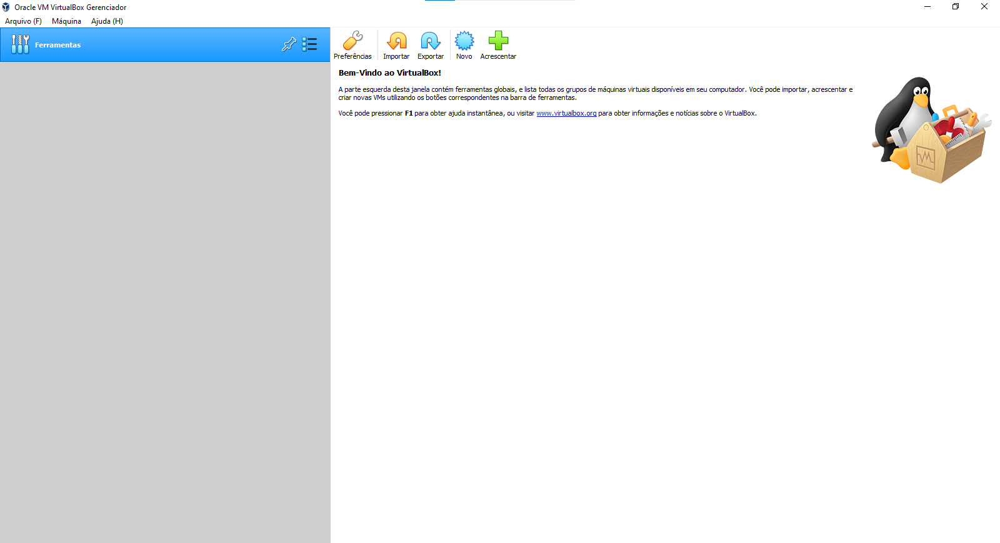

2. Clicar em novo, inicie o instalador para criar a VM e siga as instruções na tela para concluir a instalação.

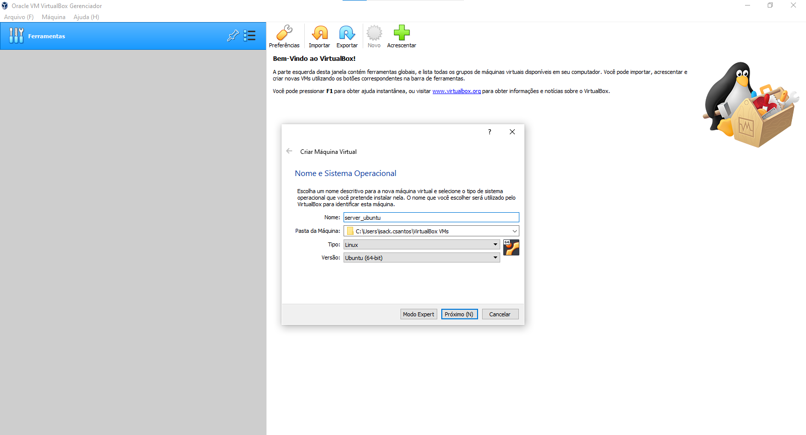

3. Após a instalação, abre a configuração, vai até armazenamento e colocar a ISO do Ubuntu Server.

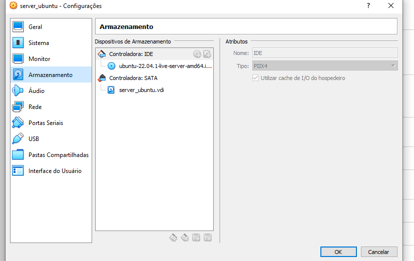

4. Agora com a ISO dentro da VM inicie o sistema.

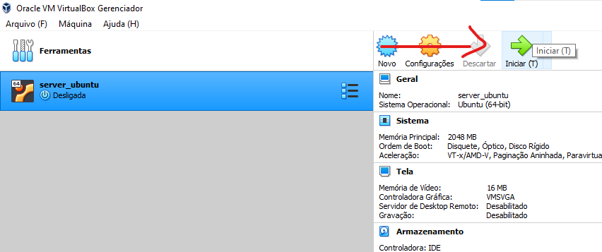

5. Após iniciar a VM vai começar a instalção do Ubuntu Server, siga as instruções na tela para concluir a instalação.

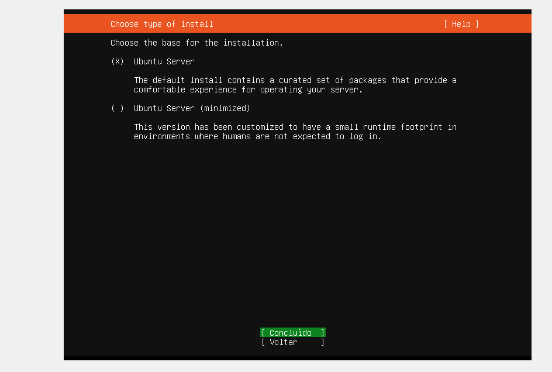

6. Após ter concluído a instalação do Ubuntu Server aparecera essa tela:

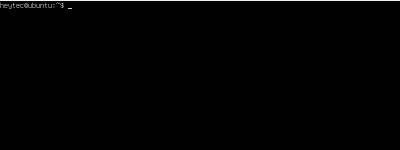

---

# Configurador Ubuntu Server
Após ter concluído a instalação do Ubuntu,  vamos fazer algumas configurações básicas u envolve várias etapas para garantir que ele esteja seguro, atualizado e pronto para ser usado. Aqui estão algumas configurações e instalação de ferramentas básicas que você pode considerar:

1. Atualizar o sistema operacional: Use o comando "sudo apt update" para atualizar o índice de pacotes do sistema e "sudo apt upgrade" para atualizar todos os pacotes instalados.

> <pre> <code>sudo apt update </code> </pre>
 

> <pre> <code>sudo apt upgrade </code> </pre>

2. Configurar um usuário não root: Crie um novo usuário usando "sudo adduser nome_do_usuario". Evite usar a conta root para tarefas diárias, pois ela possui privilégios de superusuário.

> <pre> <code>sudo adduser nome_do_usuario </code> </pre>

Essas são apenas algumas das configurações básicas que você pode fazer em um servidor Ubuntu. Existem muitas outras opções disponíveis.

---

## Ferramentas:

No sistema Ubuntu usamos alguns programas que não vem instalado no sistema que utilizamos muito no Ubuntu como "Vim" e "Net-tools".

### Vim
O Vim é um editor de texto avançado com muitos recursos e opções de personalização. Você pode encontrar tutoriais on-line para ajudá-lo a começar com o Vim e aprender a usá-lo de forma eficaz.

Para baixar o vim:
> <pre><code> sudo apt-get install vim </pre></code>

Para testar o vim basta escrever vim  (nome do arquivo)no terminal que abrirá uma tela para mostrar que está funcionando:
> <pre><code> vim (nome_do_arquivo) </pre></code>

### Net-tools
O pacote net-tools fornece um conjunto de ferramentas de rede muito úteis, como ifconfig, netstat e route, que são amplamente utilizados em sistemas Linux. Para instalar o pacote net-tools no Ubuntu, siga estes passos:

Para baixar o net-tools:
><pre><code> sudo apt-get install net-tools </pre></code>

Para testar o net-tools basta escrever ifconfig, para ver o ip da máquina:
> <pre><code> ifconfig </pre></code>    

---
## Cockpit:

Em sistemas operacionais como o Ubuntu, a palavra "cockpit" pode se referir a um software de gerenciamento de servidor baseado na web. Ele fornece uma interface gráfica do usuário (GUI) para administrar um servidor Linux a partir de um navegador da web.

O cockpit permite monitorar o desempenho do servidor, gerenciar serviços e aplicativos, visualizar logs, fazer backups e restaurações, entre outras tarefas administrativas. É uma ferramenta útil para administradores de sistemas que preferem uma interface gráfica ao invés de usar comandos de terminal para gerenciar um servidor Linux.

Para instalar o serviço cockpit usaremos o comando:
> <pre><code>sudo apt-get install cockpit -y</pre></code>  

Após a conclusão da instalação, inicie e habilite o Cockpit com:
> <pre><code>sudo systemctl enable --now cockpit.socket</pre></code>  

Agora que o Cockpit está instalado e funcionando, você pode fazer login. No entanto, dependendo de como seu sistema está configurado, você deve certificar-se de que o usuário com o qual você faz login no Cockpit tem privilégios sudo. Para isso, você emitiria o comando:

> <pre><code>sudo usermod -aG sudo USER</pre></code>  

Onde USER está o nome do usuário em questão.

Apenas por diversão, adicionaremos suporte a contêiner à nossa instância apenas para mostrar como é fácil. Na janela do terminal, emita o comando:
> <pre><code>sudo apt-get install podman cockpit-podman -y</pre></code>  

Inicie e habilite o Podman com:
> <pre><code>sudo systemctl enable --now podman</pre></code>  

Agora com o net-tools você usará para ver o ip da máquina com o comando:
> <pre><code>ifconfig</pre></code>

Depois de todo processo de instalação você vai abrir a configuração de sua máquina virtual, irá até rede clicar no avançado e clicar no botão de "Redirecionamento de Portas":

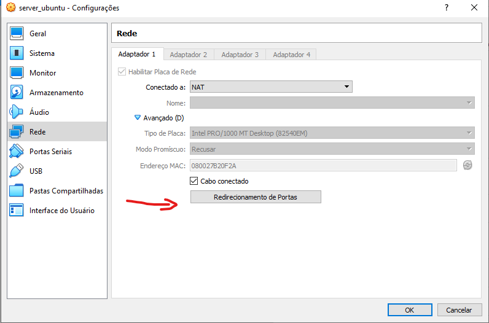

Dentro de "Redirecionamento de Portas" você vai colocar o nome do caminho, ip 127.0.0.1(localhost), 9090(porta padrão do cockpit), ip da máquina e 9090 (porta padrão do cockpit)

Agora você já pode testar o Cockpit em seu navegador, é só abrir a barra de pesquisa e colocar http://"seuipdohost":9090 .

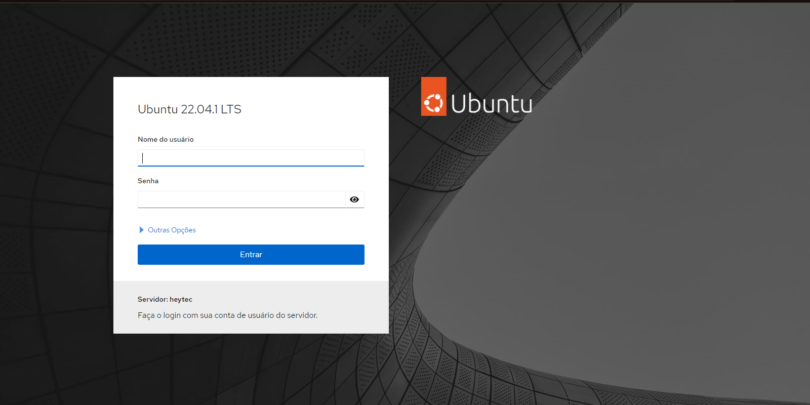

---
## Docker:

Docker é uma plataforma de software que permite criar, gerenciar e executar aplicativos em contêineres. Um contêiner é uma unidade de software que empacota código e suas dependências, permitindo que ele seja executado de maneira consistente e portátil em diferentes ambientes, como sistemas operacionais e nuvens.

Com o Docker, desenvolvedores e equipes de operações podem criar, implantar e executar aplicativos de maneira rápida e eficiente. Ele oferece uma abordagem mais leve e modular do que as máquinas virtuais tradicionais, pois cada contêiner compartilha o kernel do sistema operacional host, o que significa que os contêineres têm menos sobrecarga do que as máquinas virtuais.

O Docker é amplamente usado em ambientes de desenvolvimento e produção, permitindo que aplicativos sejam facilmente implantados em diferentes plataformas, como data centers, nuvens públicas e privadas, além de facilitar a criação e manutenção de ambientes de desenvolvimento em máquinas locais.

Em seguida, instale alguns pacotes de pré-requisito que permitem aptusar pacotes por HTTPS:
> <pre><code>sudo apt install apt-transport-https ca-certificates curl software-properties-common</pre></code>  

Em seguida, adicione a chave GPG do repositório oficial do Docker ao seu sistema:
> <pre><code>curl -fsSL https://download.docker.com/linux/ubuntu/gpg | sudo gpg --dearmor -o /usr/share/keyrings/docker-archive-keyring.gpg</pre></code>  

Adicione o repositório Docker às fontes APT:
> <pre><code>echo "deb [arch=$(dpkg --print-architecture) signed-by=/usr/share/keyrings/docker-archive-keyring.gpg] https://download.docker.com/linux/ubuntu $(lsb_release -cs) stable" | sudo tee /etc/apt/sources.list.d/docker.list > /dev/null</pre></code>  

Atualize sua lista de pacotes existente novamente para que a adição seja reconhecida:
> <pre><code>sudo apt update</pre></code>  

Certifique-se de instalar a partir do repositório do Docker em vez do repositório padrão do Ubuntu:
> <pre><code>apt-cache policy docker-ce </pre></code>  
	

Finalmente, instale o Docker: 
> <pre><code>sudo apt install docker-ce</pre></code>  

O Docker agora deve estar instalado, o daemon iniciado e o processo habilitado para iniciar na inicialização. Verifique se está em execução:
> <pre><code>sudo systemctl status Docker</pre></code>  

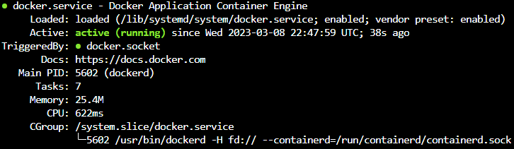

Agora com Docker baixando você colocar o usuário no group do docker, depois dar um log out para não dar mais o comado sudo:
> <pre><code>sudo usermod ${USER} -aG docker; sudo usermod nomedousuario -aG docker</pre></code>  

--- 
## Docker-Compose

Docker Compose é uma ferramenta que permite definir e executar aplicativos Docker multi-contêiner em um único ambiente, usando um arquivo YAML para configurar os serviços, redes e volumes dos contêineres. É uma extensão do Docker CLI (Interface de linha de comando) que permite definir vários contêineres como parte de um único aplicativo e automatizar o processo de execução desses contêineres.

Com o Docker Compose, é possível criar ambientes de desenvolvimento mais complexos, com múltiplos contêineres interagindo entre si, como por exemplo, um ambiente de desenvolvimento web que requer um servidor de banco de dados e um servidor web.

O arquivo YAML do Docker Compose descreve os serviços, as redes e os volumes do contêiner necessários para o aplicativo e pode ser usado para iniciar, parar e gerenciar o ciclo de vida desses contêineres como um grupo único.

O Docker Compose é uma ferramenta poderosa para desenvolvedores e equipes de operações que trabalham com aplicativos Docker complexos, pois ajuda a automatizar o processo de gerenciamento de múltiplos contêineres em um ambiente de desenvolvimento ou produção. 

Para baixar o Docker-compose vamos usar o comado:
> <pre><code>sudo apt-get install docker-compose</pre></code>

Criar um arquivo .yml com o vim chamando Docker-compose:
> <pre><code>sudo vim docker-compose.yml</pre></code>

E dentro do arquivo você colocar os seguintes alguns códigos que sempre serão alinhado (NUNCA COLOCAR O COMENTARIO DO LADO COMO ABAIXO):

> <pre><code>
>version: '3.1' #Versão
>services: 
>  db: # Nome do container
>    image: mysql:latest #Imagem do mysql
>    restart: always #Reiniciar o serviço
>    environment:
>      MYSQL_ROOT_PASSWORD: senac@123 #Senha
>      MYSQL_DATABSE: site #Nome do banco
>    ports: #Porta do mysql
>      - '6556:3306'
>    volumes: #Volume do mysql/Backup
>      - ~/site-db:/var/lib/mysql
>    expose: #Expor a porta
>      - '3306'
>
>  wordpress: # Nome do container 
>    image: wordpress # Imagem do wordpress
>    restart: always #Reiniciar o serviço
>    environment:
>      WORDPRESS_DB_HOST: db #Conexão do banco de dados 
>      WORDPRESS_DB_USER: root #Usuario do wordpress
>      WORDPRESS_DB_PASSWORD: senac@123 #Senha
>      WORDPRESS_DB_NAME: site #Nome do banco de dados
>      WORDPRESS_TABLE_PREFIX: ps # Tabela de prefixo
>    ports: #Porta do wordpress
>      - '8084:80'
>    volumes: #Volume do wordpress
>      - ~/site-wordpres:/var/www/html
>    expose: #Expor a porta
>      - '80' 
>
>  adminer: # Nome do container 
>    image: adminer # Imagem do adminer
>    restart: always #Reiniciar o serviço
>    ports:
>      - '8085:8080' #Porta do adminer
></pre></code>

Para iniciar o docker-compose:
><pre><code>docker-compose up</pre></code>

Depois desse processo você volta dentro de "Redirecionamento de Portas" você vai colocar o nome do caminho, ip 127.0.0.1(localhost), a porta que configuramos no arquivo_docker exemplo: 8085(porta padrão do cockpit), ip da máquina e de novo a porta 8085

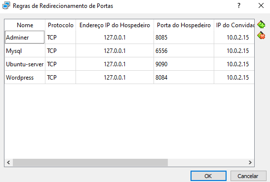

---
## MySQL

MySQL, que é um SGBD relacional, que utiliza a linguagem SQL. Também é multiusuário e multitarefas. Porém, hoje em dia o MySQL ultrapassa extraordinariamente esses limites e capacidades das versões anteriores. Podemos dizer que essas são duas das grandes características que fazem o MySQL ser tão utilizado atualmente e estar em constante crescimento.

Com o programa [Mysql Workbench](https://www.mysql.com/products/workbench/) aberto na tela inicial, clique no + e mude a porta 3306 para 6556 e teste a conexão do banco, ele irá pedir a senha e então coloque a senha que você colocou no arquivo docker-compose.yml, se der certo irá aparecer uma tela dizendo sucesso na conexão com o banco.

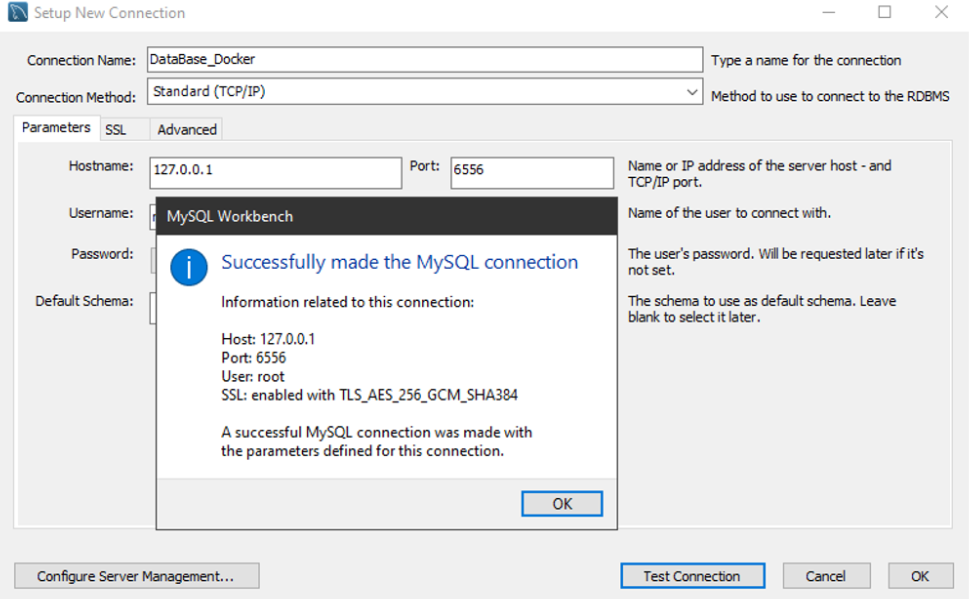

---

## Adminer

Adminer é uma ferramenta para gerenciamento de conteúdo em bancos de dados. no meu caso ele está gerenciando o MySQL. Para vermos a tela do Adminer teremos que abrir o navegador e na barra de pesquisa colocar *"http://127.0.0.1:8085"* . Veja a imagem abaixo:

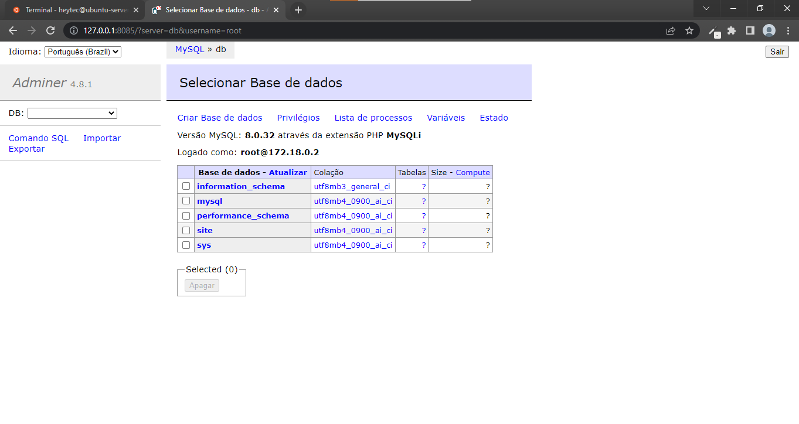

---

## Wordpress

WordPress é um sistema livre e aberto de gestão de conteúdo para internet, baseado em PHP com banco de dados MySQL

O procedimento é o mesmo feito acima com o Adminer, no seu navegador, clique na barra de pesquisa e coloque *"http://127.0.0.1:8084"* , agora siga as instruções na tela para concluir a instalação e cadastro. Depois de instalar o Wordpress, acesse usando o login que acabou de criar.

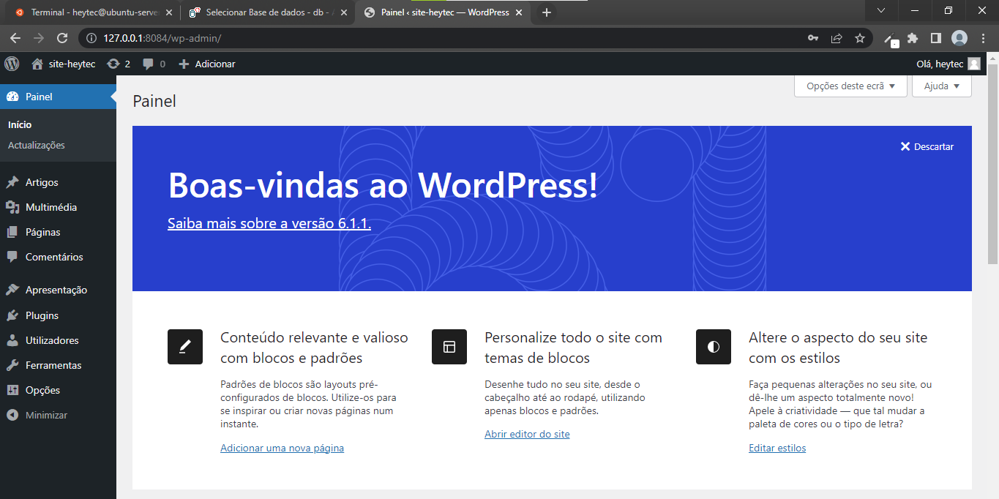

